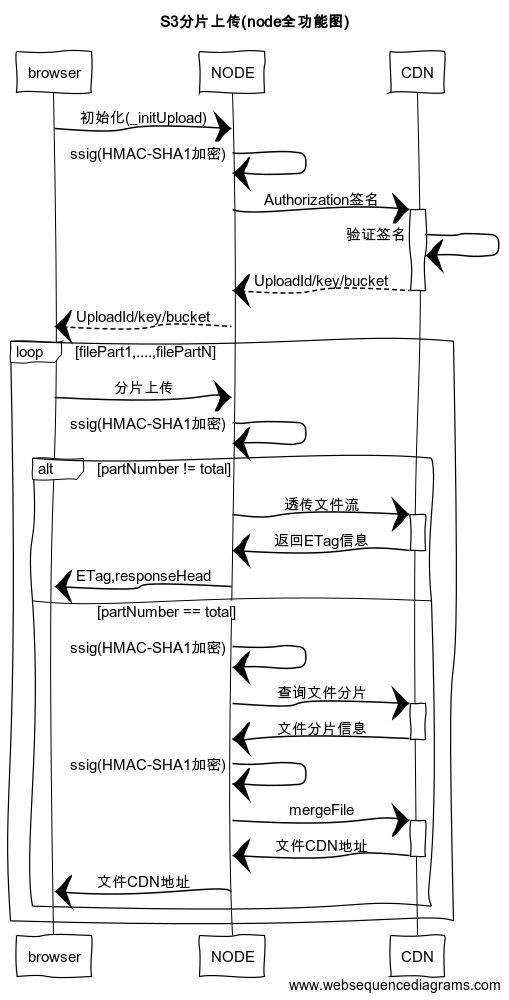

# 大文件分片上传

## 时序图



## 前序

大文件分片上传有两种思路：

+ 1、node层做签名服务，前端每次http请求都需要想node层要签名信息，然后前端与cdn交互
> 此方式需要前端工作量，不利于后期对文件的处理

+ 2、node层做签名服务，文件上传等所有的操作（本文主要采用这种方式）
> 此方式需要后端工作量，对服务器会造成压力

##  前端步骤简要

`demo`如下：
```html
<body>
  <div class='content'>
    <input type="file" id="file" accept="*/*">
    <button id='uploadBtn'>开始上传文件</button>
  </div>
</body>
<script src="https://cdn.bootcss.com/jquery/3.3.1/jquery.min.js"></script>
<script>
  let partUpload = (file, num, data) => {
    let formData = new FormData()
    let blockSize = 1 * 1024 * 1024 //分片1M
    let blockNum = Math.ceil(file.size / blockSize) // 分片总数
    let nextSize = Math.min(num * blockSize, file.size)
    let fileData = file.slice((num - 1) * blockSize, nextSize)
    formData.append("file", fileData)
    $.ajax({
      url: "",
      type: "POST",
      headers: {
        'x-amz-partnumber': num,
        'x-amz-date': new Date().toUTCString(),
        'x-amz-id': data.UploadId,
        'x-amz-key': data.Key,
        'x-amz-type': file.type,
        'x-amz-total': blockNum
      },
      data: formData,
      processData: false,
      contentType: false,
      success: function (responseText) {
        if (file.size <= nextSize) {
          console.log('上传成功')
          return;
        }
        partUpload(file, ++num, data)
      },
      error:function(e) {
        console.log(e)
      }
    })
  }
  let initUpload = (file, callback) => {
    $.ajax({
      url: "",
      type: "POST",
      headers: {
        'x-amz-type': file.type,
        'x-amz-date': new Date().toUTCString(),
        'x-amz-size': file.size
      },
      processData: false,
      contentType: false,
      success: function (data) {
        let _data = data.data
        callback(file, 1, _data)
      },
      error:function(e) {
        console.log(e)
      }
    })
  }
  $('#uploadBtn').on('click', () => {
    let file = $("#file")[0].files[0];
    initUpload(file, partUpload);
  })
</script>
```


**注意点：** 

本文采用的是串行的方式，上传分片。使用串行动作，后端根据请求头中的 `x-amz-total` 和 `x-amz-partnumber` 判断当前分片是最后一片，此时调用`cdn`的合并接口，此种方式对于集群来说也是可以的。

当然你也可以使用`Promise.all()`，将所有的分片分好，一次性发送出去，但是后端需要采用外部存储，记录当前分片是否是最后一片。
采用串行如果其中一片失败了，我们需要将文件全部分片重新上传。
使用并行，需要记录失败的分片数，重新上传。


## 后端逻辑

### 第一步：公共服务，生成[ssig](http://open.sinastorage.com/doc/scs/guide/sign)

>  云存储服务通过使用签名来验证及识别访问者的身份
 sinaCloud生成签名有 3中方式
 + 1、通过SDK中的相关方法生成签名
 + 2、通过管理控制台的”URL签名“工具，填写相关参数，自动生成相关请求的URL签名
 + 3、根据HTTP Request Header(Authorization)或者URL签名认证方式或者Cookie认证方式

本文实现签名的实例：
```javascript
import crypto from 'crypto'
export default (secret_AccessKey: string, contentType: string, date: string, key:string, HTTPVerb: string, contentMD5: string, canonicalizedAmzHeaders: string, canonicalizedResource: string) => {
  let _secret_AccessKey = secret_AccessKey
  // 文件类型
  let _contentType = contentType
  // 代表本次请求的有效时间
  let _date = date
  // 表示操作名，即HTTP的请求方式，应该为PUT、GET、DELETE、HEAD和POST中的一种.请求的方式
  let _HTTPVerb = HTTPVerb
  // post请求不需要,可以设置为空
  let _contentMD5 = contentMD5
  // 请求头中所有以x-amz-和x-sina-开头的header，将他们的key转化为小写并按顺序排列，key和value之间用冒号相连，以换行符“\n”连接和结尾，此处设置为空
  let _canonicalizedAmzHeaders = canonicalizedAmzHeaders || ''
  // 是指想要访问的资源,这里不确定是写 '/' 还是bucket+objectName，注意：另外，如果您要访问的URL中带有如下的参数, 则需要加入sub-resource参与签名
  let _canonicalizedResource = canonicalizedResource
  let StringToSign = _HTTPVerb + "\n" +
    _contentMD5 + "\n" +
    _contentType + "\n" +
    _date + "\n" +
    _canonicalizedAmzHeaders +
    _canonicalizedResource
  return crypto.createHmac('sha1', _secret_AccessKey).update(StringToSign).digest('base64')
}
```

### 第二步：大文件分片上传初始化[接口](http://open.sinastorage.com/doc/scs/api)

**注意：** 在初始化上传接口中要求必须进行用户认证，匿名用户无法使用该接口

```javascript
import rp from 'request-promise'
import fs from 'fs'
import path from 'path'
import ssig from '../tools/ssig'
import CONFIG from '../config/config'
let bucketName = CONFIG.SinaCloud.bucketName
let accessKeyId = CONFIG.SinaCloud.accessKeyId
let secretAccessKey = CONFIG.SinaCloud.secretAccessKey
let content_type = ctx.header['x-amz-type']
let date = ctx.header['x-amz-date']
let fileName = (uuidv4().substr(0,8) + '.' + mime.getExtension(content_type))
let fileSize = ctx.header['x-amz-size']
let HTTPVerb = 'POST'
let contentMD5 = ''
let canonicalizedAmzHeaders = ''
// 可以通过对文件名，文件类型，以及文件大小进行md5加密作为文件的key
let key = crypto.createHash('md5').update(content_type + date + fileName + fileSize).digest('hex') + '/' + fileName
let canonicalizedResource = '/' + bucketName + '/' + key + '?multipart'
let _ssig = ssig(secretAccessKey, content_type, date, key, HTTPVerb, contentMD5, canonicalizedAmzHeaders, canonicalizedResource)
let options = {
  method: 'POST',
  uri: `http://${bucketName}.sinastorage.com/${key}?multipart&formatter=json`,
  headers: {
    'Authorization': `SINA ${accessKeyId}:${_ssig}`,
    'Date': date,
    'Content-Type': content_type
  },
  json: true
};
let _result: RESULT = { status: 200, message: '', data: {} }
await rp(options).then(data => {
  _result.message = '大文件分片上传初始化成功'
  _result.data = data
}).catch((e) => {
  _result.status = 403
  _result.message = '大文件分片上传初始化失败'
  _result.stack = e
  _result.data = { UploadId: '', __attr: '', Bucket: '', Key: '' }
})

```
返回值
```JavaScript
{ 
  UploadId: '',
  __attr: { xmlns: '' },
  Bucket: '',
  Key: '' 
}
```

此处需要注意的是：

+ 1、`key`的值为了保证唯一，防止多用户上传过程中出现相同名称的文件，覆盖的问题
```javascript
let key = crypto.createHash('md5').update(content_type + date + fileName + fileSize).digest('hex') + '/' + fileName
```

> fileName，使用`uuid`

```javascript
import mime from 'mime'
import uuidv4 from 'uuid/v4'
let fileName = (uuidv4().substr(0,8) + '.' + mime.getExtension(content_type))
```

2、请求头中的`'Authorization': SINA ${accessKeyId}:${ssig}`。此处的`ssig`需要重新签名；`content_type`填写文件类型

3、`canonicalizedResource`的值需要加上`sub-resource`


到此我们完成文件上传的初始化，前端拿到`uploadId等信息。可以开始分片上传了`


### 第三步：请求分片上传[接口](http://open.sinastorage.com/doc/scs/api)

分片上传前，还是需要进行签名认证。实例：

```javascript
import rp from 'request-promise'
import fs from 'fs'
import path from 'path'
import ssig from '../tools/ssig'
import CONFIG from '../config/config'
let bucketName = CONFIG.SinaCloud.bucketName
let accessKeyId = CONFIG.SinaCloud.accessKeyId
let secretAccessKey = CONFIG.SinaCloud.secretAccessKey
let _ssig = ssig(secretAccessKey, content_type, date, key, HTTPVerb, contentMD5, canonicalizedAmzHeaders, canonicalizedResource)
let options = {
  method: 'PUT',
  uri: `http://${bucket}.sinastorage.com/${key}?partNumber=${partNumber}&uploadId=${uploadId}&formatter=json`,
  headers: {
    'Authorization': `SINA ${accessKeyId}:${_ssig}`,
    'Date': date,
    'Content-Length': file.size,
    'Content-MD5': '',
    'Content-Type': content_type
  },
  body: fs.createReadStream(path.resolve(__dirname, file.path))
};
let _result: RESULT = { status: 200, message: '', data: {} }
await rp(options).then(async (response) => {
  _result.data = response.headers
  _result.message = '文件分片上传成功'
  if (partNumber == total) {
    // 查询所有的分片
    let list = (await listparts(content_type, date, key, uploadId)) as any[]
    // 合并所有的分片
    await mergeFile(date, key, uploadId, list)
    _result.data = response.headers
    _result.message = '文件分片上传成功'
    _result.url = `http://${bucket}.sinastorage.com/${key}`
  } else {
    _result.data = response.headers
    _result.message = '文件分片上传成功'
  }
}).catch((e) => {
  _result.status = 403
  _result.message = '文件分片上传失败'
  _result.stack = e
})
```

注意点：

+ 1、`Content-Length`的值是文件大小的值`file.size`

+ 2、`Content-MD5`。`CDN`主要检测文件大小是否完整，此值可以为空，为空的话，是以content-length为主

+ 3、接口相应：
```javascript
HTTP/1.1 200 OK
Date: Tue, 08 Apr 2014 02:59:47 GMT
Connection: keep-alive
X-RequestId: 00078d50-1404-0810-5947-782bcb10b128
X-Requester: Your UserId
Etag: <Etag>
```

此处的`Etag`，具名标签，你可以理解为分片的md5值。服务端可以记录每个分片的`Etag`和`partNumber`为后面合并做准备，服务端也可以不记录。`CDN`提供接口可以查询所有的分片值。本文采用的是不记录分片的值


### 第四步，查询所有的分片

```javascript
let listparts = (contentType: string, date: string, key: string, uploadId: string) => {
  let HTTPVerb = 'GET'
  let contentMD5 = ''
  let canonicalizedAmzHeaders = ''
  let canonicalizedResource = '/' + bucketName + '/' + key + `?uploadId=${uploadId}`
  let _ssig = ssig(secretAccessKey, contentType, date, key, HTTPVerb, contentMD5, canonicalizedAmzHeaders, canonicalizedResource)
  let options = {
    method: 'GET',
    uri: `http://${bucketName}.sinastorage.com/${key}?uploadId=${uploadId}&formatter=json`,
    headers: {
      'Authorization': `SINA ${accessKeyId}:${_ssig}`,
      'Date': date,
      'Content-Type': contentType
    },
    json: true
  }
  return new Promise((resolve, reject) => {
    rp(options).then(data => {
      resolve(data.Parts)
    }).catch(e => {
      resolve([])
    })
  })
}
```

### 第五步，合并所有的分片

```javascript
let mergeFile = (date: string, key: string, uploadId: string, list: any[]) => {
  let HTTPVerb = 'POST'
  let contentMD5 = ''
  let canonicalizedAmzHeaders = ''
  let canonicalizedResource = '/' + bucketName + '/' + key + `?uploadId=${uploadId}`
  let _ssig = ssig(secretAccessKey, 'text/json', date, key, HTTPVerb, contentMD5, canonicalizedAmzHeaders, canonicalizedResource)
  let options = {
    method: 'POST',
    uri: `http://${bucketName}.sinastorage.com/${key}?uploadId=${uploadId}&formatter=json`,
    headers: {
      'Authorization': `SINA ${accessKeyId}:${_ssig}`,
      'Date': date,
      'Content-Type': 'text/json'
    },
    json: true,
    resolveWithFullResponse: true,
    body: list
  }
  return new Promise((resolve, reject) => {
    rp(options).then(data => {
      resolve(data)
    }).catch(e => {
      resolve({})
    })
  })
}
```


遇到的坑：

+ 并行问题，`promise.all`  通过`upload.conter`计算，多台机器，会出问题，用外部存储，成本高

+ `content-length`:是文件大小，`file.size`

+ 文件名带空格,或者特殊符号的，签名失败

+ `canonicalizedResource`中的`sub-resource`路径问题，分片用到的是 `?multipart`
